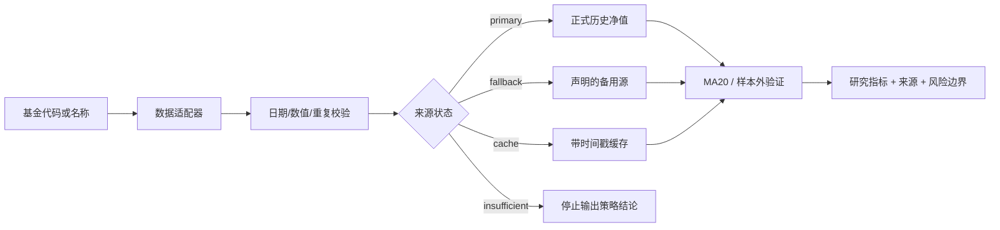

# Jushi Fund Research Open


一个面向场外基金研究的可审计 Python 参考实现，也是“聚势”AI 基金投研与持仓管理平台的开源 companion project。

项目不保存支付宝、微信账号凭证或用户持仓，不提供买卖指令，也不承诺投资收益。它重点解决投研系统里最容易被忽略的工程问题：数据从哪里来、当前数据是否可信、主源失败后能否解释降级、策略结论是否经过样本外验证。

## 项目亮点

### 1. 把“数据可用”与“数据可信”分开

项目不把所有数字都当成同一种数据：

- 收盘后的正式历史净值用于研究和回测；
- 盘中估值只作为界面参考，不替代正式净值；
- 基金公开重仓只代表报告期披露内容，不包装成实时持仓；
- 数据源失败时返回明确状态，不用演示数据填空。

### 2. 降级链本身可审计

每次数据拉取都可以保留来源、有效行数、状态、时间和失败原因。系统按“主源 → 声明的备用源 → 带时间戳的本地缓存 → 数据不足”处理，不把缓存伪装成实时数据。

### 3. 策略验证有明确的时间边界

MA20 研究模块将数据按时间排序，默认前 60% 作为训练/研究区间，后 40% 作为测试区间；测试区间不足时直接返回 `insufficient_sample`，不输出看似精确的统计结论。

### 4. 结果可以解释，也可以拒答

输出不仅包含收益和回撤，还包含数据状态、样本规模和风险提示。这样 Agent 或前端可以区分“有数据但表现一般”和“没有足够数据，不应该给出结论”。

## 架构图

这是代码对应的工程架构图，不是产品运行截图：




## 代码结构

```text
src/jushi_fund_research/
├── data_policy.py   # 数据状态、日期/净值规范化与字段校验
├── nav_chain.py     # 多源净值链、备用源与缓存降级
└── strategy.py      # MA20 与 60/40 样本外回测

tests/
├── test_nav_chain.py
└── test_strategy.py
```

核心模块只依赖 Python 标准库，真实 FastAPI、SQLite 或数据供应商适配器可以放在应用外层；这样策略逻辑不会和某一个易变接口绑定。

## 已验证内容

当前仓库通过 8 项单元测试，覆盖以下边界：

| 验证项 | 结论 |
|---|---|
| 日期和单位净值字段 | 非法日期、缺失字段、非有限值和非正净值会被丢弃 |
| 重复日期 | 同一来源的重复日期按确定规则合并，最后一个有效值保留 |
| 主源异常 | 主源抛出异常时进入声明的备用源 |
| 空主源 | 主源没有有效行时不会伪造数据 |
| 本地缓存 | 只有经过同样校验的缓存才会标记为 `cache` |
| 数据不足 | 所有来源都不足时返回 `insufficient` |
| 样本外边界 | 回测明确返回训练行数和测试行数 |
| 小样本保护 | 训练集或测试集不足时拒绝输出策略统计结果 |

运行验证：

```powershell
cd fund-research-open
$env:PYTHONPATH = "src"
& "C:\Python314\python.exe" -m unittest discover -s tests -v
```

预期结果：`Ran 8 tests ... OK`。

## 一个最小调用示例

```python
from jushi_fund_research.nav_chain import fetch_with_fallback

result = fetch_with_fallback(
    sources=[
        ("primary", load_formal_nav),
        ("fallback", load_backup_nav),
    ],
    cache=read_local_cache(),
)

if result.status.value == "insufficient":
    print("数据不足，停止输出策略结论")
else:
    print(result.selected_source, len(result.points), result.message)
```

真实适配器需要将上游字段映射为 `date` 和 `nav`，并自行记录请求时间、基金代码、分页、覆盖日期、返回行数与失败原因。

## 聚势平台的实测结果与开源测试的边界

下面是“聚势”平台在真实基金净值上的研究结果，不是本仓库用合成数据跑出来的宣传指标：

- 在 400 个真实交易日样本上进行样本外验证；
- MA20 规则测试集回撤由买入持有的 **-12.5% 降至 -3.0%**；
- “单日跌幅不超过 -2% 后的 5 日胜率”为 64%，但仅出现 22 次，已标记为样本不足，没有升级为正式投资规则。

开源仓库自身只承诺代码层面的数据校验、降级状态、样本切分和边界测试；不把上面的平台实测数字包装成仓库自动运行结果。

## 公开决策依据，而不是不可复核的“黑箱思维链”

项目将研究过程压缩为可公开审计的证据链：

```text
数据来源 → 字段校验 → 来源状态 → 时间切分 → 策略规则 → 指标 → 风险提示
```

每一步都能对应到代码、输入字段或测试断言。这样面试官可以复现“为什么使用这条数据、为什么拒绝输出结论”，而不需要依赖模型无法验证的内部推理过程。

## 数据来源与同类项目参考

项目参考了同类型开源项目的公开设计，但没有复制其代码或数据：

- [hzm0321/real-time-fund](https://github.com/hzm0321/real-time-fund)：基金名称检索、盘中估值和历史净值备用方向；
- [daggerFS/xalpha](https://github.com/daggerFS/xalpha)：场外基金研究、定投与回测的研究边界；
- [akfamily/akshare](https://github.com/akfamily/akshare)：公开金融数据的适配思路；
- [langchain-ai/langgraph](https://github.com/langchain-ai/langgraph)：显式状态、流程分支和失败处理思路。

详细的来源、许可和贡献边界见 [SOURCES.md](SOURCES.md) 与 [NOTICE.md](NOTICE.md)。

## 简历项目描述

**Jushi Fund Research Open｜基金数据与策略验证开源参考实现**

独立设计基金数据质量与策略验证链路，区分正式净值、盘中估值、备用源和本地缓存；实现数据校验、日期去重、可审计降级、MA20 信号及 60/40 样本外回测，并以 8 项单元测试验证小样本、空数据和主源失败等关键边界。

## 许可证与风险声明

仓库远端预置的 `LICENSE` 为 CC0 1.0；本项目新增代码的 MIT 许可文本见 [LICENSE-MIT](LICENSE-MIT)。外部数据服务、第三方项目代码、商标和数据服务条款不由本仓库许可证覆盖。

本项目仅用于软件工程和研究方法展示，不构成投资建议，不自动执行交易。使用真实数据时应自行核对数据服务条款、访问频率、商业使用权限和结果准确性。
