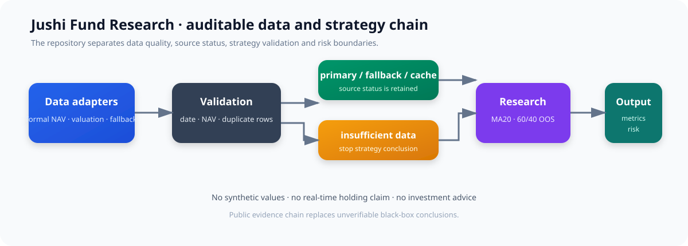
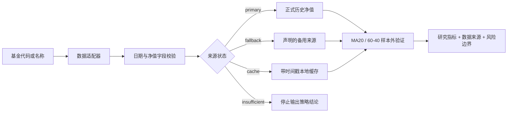

# 聚势：可审计的基金数据与策略研究开源参考实现


> 这是“聚势”AI 基金投研与持仓管理平台的开源 companion project：把基金数据接入、质量校验、来源降级和策略验证中最需要被解释的部分拆出来，做成一个可以阅读、运行和复核的 Python 参考实现。

本项目面向场外基金研究场景，不保存支付宝、微信账号凭证或用户持仓，不提供自动交易和买卖指令，也不承诺投资收益。项目的重点不是用一个模型替用户做决定，而是把研究过程中容易被忽略的问题显式化：数据从哪里来、它属于什么时间状态、来源失败时如何降级、样本不足时是否应该拒绝结论。

## 为什么要做这个项目

基金投研产品表面上只需要展示净值、涨跌幅和曲线，真正落地时却会遇到一组连续的问题：

- 同一个基金可能同时出现正式历史净值、盘中估值和公开重仓信息，它们的时间含义并不相同；
- 外部接口可能超时、限流、返回空数组或字段发生变化，页面不能把这些情况伪装成“最新数据”；
- 基金名称识别、数据分页和缓存都可能产生静默错误，错误结果往往比明确报错更危险；
- 一条策略在研究样本上有效，不代表在未参与规则设计的测试样本上仍然有效；
- 只有一个收益数字时，用户无法判断数据来源、样本规模和风险边界。

因此，聚势把研究链路拆成几个可以单独核验的步骤：

```text
基金代码/名称
    ↓
数据适配器
    ↓
日期与净值字段校验
    ↓
主源 → 声明的备用源 → 带时间戳缓存 → 数据不足
    ↓
正式净值研究 / 样本外策略验证
    ↓
收益、回撤、数据状态、样本规模与风险提示
```

这里的“可审计”，指每一步都能对应到输入字段、代码逻辑或测试断言，而不是让用户相信一段无法复核的模型解释。

## 项目与聚势平台的关系

聚势平台是一个面向个人投资者的完整应用，包含持仓截图导入、本地 OCR、基金匹配、持仓分析、持续观测和前端交互等产品能力。本仓库没有把用户截图、账号信息、完整客户端代码或第三方密钥上传到 GitHub，而是抽取其中最适合开源和复用的研究基础层：

| 层级 | 聚势平台中的能力 | 本仓库是否包含 |
|---|---|---|
| 输入层 | 支付宝/微信持仓截图、本地 OCR、人工确认 | 否，属于上层应用能力 |
| 基金定位 | 名称规范化、候选匹配、低置信度确认 | 作为适配思路记录，未伪装成当前核心代码能力 |
| 数据层 | 正式净值、盘中估值、公开披露重仓 | 包含净值质量与来源状态抽象 |
| 研究层 | MA20、样本外边界、回撤与风险提示 | 包含可运行的简化研究实现 |
| 工程层 | 分页增量、缓存、备用源、数据不足 | 包含多源降级和验证规则 |
| 产品层 | React、FastAPI、SQLite、Electron 界面 | 不在本仓库中 |

这种拆分是有意的。开源仓库只承诺代码中真实存在并且能够运行的能力；平台级结果和产品级功能会在文档中单独标记，避免把完整产品的描述误读成仓库已经提供的全部功能。

## 项目亮点

### 1. 先定义数据语义，再讨论收益

项目不把所有“最新数字”视为同一种数据。研究链路至少区分以下三类信息：

| 数据类型 | 适用场景 | 不适用场景 |
|---|---|---|
| 收盘后的正式历史净值 | 历史曲线、收益计算、策略回测 | 盘中实时决策 |
| 盘中估值 | 前端当日变化参考 | 替代收盘净值、作为历史回测数据 |
| 基金公开重仓 | 解释报告期的行业或个股暴露 | 直接当作当前实时持仓 |

正式净值和盘中估值的时间边界不同，公开重仓还带有报告期属性。系统如果无法确认当前状态，应展示数据状态或提示用户核验，而不是把不同时间口径拼成一个看似完整的结论。

### 2. 降级链有明确顺序和可追踪状态

当前实现按照以下顺序处理历史净值：

```text
primary      主历史净值来源
    ↓ 失败或有效行数不足
fallback     已声明的备用来源
    ↓ 仍不可用
cache        经过同样校验的本地缓存
    ↓ 仍不可用
insufficient 停止输出策略结论
```

每次尝试会留下来源名称、有效行数、状态、时间戳和失败原因。缓存不是“最新数据”的替身，返回缓存时必须明确标注 `cache`；所有来源都不足时返回 `insufficient`，不生成合成净值、不使用演示数据填空。

### 3. 策略验证有清晰的时间边界

MA20 研究模块会先按交易日期排序，再按默认 60%/40% 切分研究区间和测试区间。测试段的收益、基准收益和最大回撤单独计算；训练区间或测试区间不足时直接返回 `insufficient_sample`。

这不是对策略有效性的保证，而是一条最低限度的研究纪律：不能因为样本太少，仍然输出带有小数点的精确结论；不能用测试结果反复调参后，再把同一段数据称为“样本外验证”。

### 4. 结果中同时保留指标和限制条件

回测结果不仅返回策略收益，还返回训练行数、测试行数、窗口大小、基准收益、策略回撤、基准回撤和风险提示。上层 Agent 或前端可以据此展示：

- 这次研究使用了多少条数据；
- 哪一段是研究区间，哪一段是测试区间；
- 使用了正式净值、备用源还是缓存；
- 是否因为样本不足而拒绝结论；
- 结果是否仅供研究，不构成投资建议。

## 架构图

下面的图对应当前代码的主要数据流，不是虚构的生产部署图，也不代表本仓库已经包含完整的 Electron 或 FastAPI 应用。





## 典型使用场景

### 场景一：用户从持仓截图导入基金

在聚势平台中，用户可以把支付宝或微信持仓截图交给本地 OCR。OCR 负责提取基金名称、金额、收益和收益率等候选字段；应用层再根据名称定位基金代码，并对低置信度结果要求确认。

本仓库不接收和保存这些截图，而是承接“基金代码已经确认后，怎样可靠获取研究数据”的部分。这样既保留了产品闭环的研究基础，也避免把个人账户信息和图片上传到公共仓库。

### 场景二：历史净值接口临时不可用

适配器先调用主来源。如果主来源超时、抛出异常、返回空数据或有效行数不足，链路会记录失败原因并尝试声明的备用来源。备用来源成功时，结果状态为 `fallback`；如果实时来源都不可用但本地缓存经过同样校验，则返回 `cache`。

前端可以根据状态显示“主源成功”“备用源”“缓存数据”或“数据不足”，而不是给用户一个没有来源说明的数字。

### 场景三：样本不足，系统应该拒绝给出策略结论

当输入数据不足以形成训练区间和测试区间时，`backtest_ma20_oos` 返回 `insufficient_sample`，收益和回撤字段保持为空。上层应用可以显示“当前数据不足，暂不评价策略”，而不是将少量数据包装成高置信度建议。

### 场景四：需要把研究结果交给 Agent

Agent 不应该直接读取一段没有来源的自由文本。更稳妥的方式是先调用数据链，读取结构化的来源状态、有效行数、净值点和回测结果，再让模型把这些字段转换成用户能够理解的说明。模型负责解释和交互，数据链负责约束事实边界。

## 核心模块

### `data_policy.py`：数据规范化与字段校验

该模块提供 `NormalizedNav`、`DataStatus` 和 `validate_nav_rows` 等基础能力：

- 接受适配器返回的普通 Python Mapping，降低对具体数据供应商的耦合；
- 支持 `YYYY-MM-DD`、`YYYY/MM/DD` 和 `YYYY.MM.DD` 日期格式；
- 拒绝非法日期、缺失字段、非有限数字和小于等于零的净值；
- 同一来源同一日期出现多条有效记录时，保留最后一条有效值；
- 统一返回按日期排序的 `NormalizedNav` 列表。

它只负责“这条记录是否符合基础字段规则”，不负责判断基金是否适合投资，也不把字段校验误称为投资建议。

### `nav_chain.py`：多源数据链与降级

`fetch_with_fallback` 接收按优先级排列的 `(source_name, fetcher)`，依次完成：

1. 调用来源适配器；
2. 对返回行做统一字段校验；
3. 判断有效行数是否达到 `min_rows`；
4. 记录成功、拒绝或异常；
5. 必要时进入备用源和缓存；
6. 所有分支都失败时返回 `DataStatus.INSUFFICIENT`。

适配器可以位于 FastAPI 服务、定时任务或本地脚本中，研究逻辑不需要绑定某一家数据接口。外部接口字段需要先映射为 `date` 和 `nav`，再交给这条链处理。

### `strategy.py`：MA20 与样本外回测

`backtest_ma20_oos` 是一个用于展示研究边界的轻量实现：

- 对输入净值按日期排序；
- 默认前 60% 为研究/训练区间，后 40% 为测试区间；
- 使用过去窗口的均值作为 MA20 信号参考；
- 在测试区间计算策略收益和买入持有基准收益；
- 计算测试曲线上的最大回撤；
- 训练或测试样本不足时拒绝输出收益结果；
- 结果携带“仅供研究，不构成投资建议”的风险说明。

它没有自动寻找最优窗口，也没有把一组参数搜索后的最好结果包装成稳定规律。任何参数调整都应在独立研究记录中说明，并使用新的时间段进行复核。

## 外部数据来源与接入边界

聚势平台曾围绕公开基金接口进行适配探索。当前开源仓库不内置网络爬虫和密钥，真实接入需要由使用者在遵守接口条款的前提下实现适配器，并记录请求时间、基金代码、分页信息、覆盖日期、返回行数和失败原因。

| 数据用途 | 参考方向 | 使用边界 |
|---|---|---|
| 正式历史净值 | Eastmoney 基金历史净值接口 | 用于历史研究前必须校验字段和覆盖范围 |
| 盘中估值参考 | 天天基金估值接口 | 只作为当日参考，不替代正式净值 |
| 备用历史数据 | 基金公开数据页或同类开源适配方向 | 返回时必须标明 `fallback` 并重新校验 |
| 基金目录与披露信息 | AkShare 等公开数据适配方向 | 需要关注字段变化、频率和使用条款 |

参考来源不等于永久可用接口，也不等于本仓库对外部服务的背书。接口可能限流、改字段、停止服务或限制商业用途，生产系统必须自行监控和降级。

## 研究方法：从数据到公开结论

项目把研究过程压缩成一条能够被检查的证据链：

```text
来源声明
    ↓
字段映射
    ↓
日期 / 净值校验
    ↓
重复日期处理
    ↓
来源状态与缓存时间
    ↓
按时间切分训练段与测试段
    ↓
计算收益与回撤
    ↓
输出样本规模、限制条件和风险提示
```

每一层都回答一个具体问题：

| 环节 | 需要回答的问题 | 当前实现中的证据 |
|---|---|---|
| 来源声明 | 这批数据从哪里来？ | `source`、来源适配器名称 |
| 字段校验 | 这条记录能否参与研究？ | 日期和正数净值校验 |
| 去重 | 同一天多条数据如何处理？ | 最后一条有效记录覆盖 |
| 降级 | 主源失败后用了什么？ | `primary`、`fallback`、`cache`、`insufficient` |
| 时间边界 | 是否把测试数据用于调参？ | 60%/40% 训练测试划分 |
| 风险提示 | 结论有哪些限制？ | 小样本拒绝与 warning 字段 |

这套设计参考了同类型开源项目常见的“数据适配器—研究逻辑分离”思路，但没有复制它们的代码或数据。项目更关注将这些思路转化为适合聚势产品的可验证边界。

## 已验证内容

当前仓库已通过 8 项单元测试，测试不是为了制造一个漂亮的覆盖率数字，而是覆盖数据链最容易静默出错的分支：

| 验证项 | 当前结论 |
|---|---|
| 非法日期 | 被忽略，不进入标准化结果 |
| 缺失或非法净值 | 被忽略，不进入标准化结果 |
| 非有限值和非正净值 | 被拒绝 |
| 重复日期 | 同一来源按确定规则合并，最后一条有效值保留 |
| 主源异常 | 进入声明的备用来源 |
| 主源为空 | 不伪造实时数据，可使用经过校验的缓存 |
| 全部来源不足 | 返回 `insufficient`，不选择来源 |
| 日期分隔符 | `-`、`/`、`.` 三种常见格式统一为日期对象 |
| 样本外边界 | 返回训练行数和测试行数 |
| 小样本保护 | 训练段或测试段不足时拒绝策略统计结果 |
| 风险说明 | 正常回测结果保留研究免责声明 |

运行方式：

```powershell
cd fund-research-open
$env:PYTHONPATH = "src"
& "C:\Python314\python.exe" -m unittest discover -s tests -v
```

预期结果：

```text
Ran 8 tests ... OK
```

## 聚势平台的真实研究结果与仓库测试结果

以下数据来自聚势平台在真实基金净值上的研究记录，不是本仓库用合成数据自动跑出的宣传指标：

- 使用 400 个真实交易日样本进行样本外验证；
- MA20 规则测试集回撤由买入持有的 **-12.5% 降至 -3.0%**；
- “单日跌幅不超过 -2% 后的 5 日胜率”为 **64%**；
- 该条件只出现 **22 次**，样本量不足，因此没有升级为正式投资规则。

这些结果的正确解读是：它们是一次具体研究样本中的观察，不是未来收益承诺，也不是开源仓库的自动验收结果。仓库自身目前只承诺代码层面的字段校验、来源状态、缓存降级、样本切分和边界测试。

## 最小调用示例

外部适配器只需要把供应商字段转换为 `date` 和 `nav`：

```python
from jushi_fund_research.nav_chain import fetch_with_fallback


result = fetch_with_fallback(
    sources=[
        ("primary", load_formal_nav),
        ("fallback", load_backup_nav),
    ],
    cache=read_local_cache(),
)

if result.status.value == "insufficient":
    print("数据不足，停止输出策略结论")
else:
    print(result.selected_source, len(result.points), result.message)
```

建议上层服务继续记录：基金代码、请求时间、请求页码、覆盖起止日期、原始响应摘要、有效行数和错误原因。不要把完整用户截图、账号信息、Token 或第三方 API Key 写入日志和公开仓库。

## 与聚势应用的整合方式

在完整应用中，可以将本仓库作为研究服务的纯 Python 核心：

```text
React / Electron
        ↓
FastAPI 研究接口
        ↓
基金识别结果 + 数据适配器
        ↓
jushi_fund_research
        ↓
SQLite / 缓存 / 审计记录
        ↓
持仓分析、风险提示和 Agent 解释
```

推荐的接口边界如下：

1. OCR 层只负责从截图中提取候选字段，不直接决定基金代码；
2. 基金匹配层负责候选列表和置信度，低置信度结果必须确认；
3. 数据层负责净值、来源状态和覆盖日期，不读取用户支付账户；
4. 策略层只接受经过校验的结构化净值，不接受模型自由生成的数字；
5. Agent 层负责把结构化结果解释给用户，不能绕过 `insufficient` 状态生成结论。

这样做可以把“识别错了”“数据旧了”“接口失败了”“样本不足”分别暴露出来，而不是把所有问题压缩成一句模糊的 AI 建议。

## 代码结构

```text
fund-research-open/
├── README.md
├── SOURCES.md                 # 数据来源、接口边界与参考项目
├── NOTICE.md                  # 开源项目致谢与许可说明
├── LICENSE
├── LICENSE-MIT
├── pyproject.toml
├── docs/
│   └── architecture.svg       # 数据链路架构图
├── src/
│   └── jushi_fund_research/
│       ├── __init__.py
│       ├── data_policy.py     # 数据状态、日期/净值规范化与校验
│       ├── nav_chain.py       # 多源净值、备用源与缓存降级
│       └── strategy.py        # MA20 与 60/40 样本外回测
└── tests/
    ├── test_nav_chain.py
    └── test_strategy.py
```

核心模块只依赖 Python 标准库。FastAPI、SQLite、Electron、OCR 和前端组件可以放在外层应用中，不会反向污染研究规则，这使得同一套策略逻辑可以被接口服务、命令行脚本和离线研究任务复用。

## 快速开始

### 1. 获取代码

```powershell
git clone https://github.com/yangziwen112/yangziwen112-jushi-fund-research-open.git
cd yangziwen112-jushi-fund-research-open
```

### 2. 运行测试

```powershell
$env:PYTHONPATH = "src"
python -m unittest discover -s tests -v
```

如果本机存在多个 Python 环境，请确认使用 Python 3.10 或更高版本。仓库核心实现不要求联网，也不会在测试中请求外部基金接口。

### 3. 接入真实数据

实现一个返回字典列表的适配器，把供应商字段映射为：

```python
{
    "date": "2024-01-02",
    "nav": "1.1020",
}
```

然后交给 `fetch_with_fallback`。生产适配器应额外处理请求超时、限流、分页、字段变更、日期覆盖范围和本地缓存时间；仓库不会替使用者绕过外部服务的访问限制。

## 数据安全与使用边界

- 不抓取或保存支付宝、微信登录凭证、Cookie、Token、支付账户信息和完整个人持仓截图；
- 不在公开仓库提交 API Key、代理配置、数据库密码和用户交易记录；
- 用户截图应尽量在本地 OCR 链路内处理，上传前应脱敏；
- 数据源失败时必须显示失败状态或数据不足，不用旧数据伪装最新数据；
- 公开重仓数据必须保留披露期，不得包装为用户当前实时持仓；
- 盘中估值不能替代正式净值，也不应直接用于历史回测；
- 所有策略结果都只用于研究和风险提示，不构成投资建议；
- 使用外部接口和公开数据时，应自行确认访问频率、版权、商业使用和服务条款。

## 参考项目与致谢

本项目参考了同类型开源项目在数据适配、基金研究、回测边界和状态工作流方面的公开设计，但没有复制其代码、账号数据或私有数据：

- [hzm0321/real-time-fund](https://github.com/hzm0321/real-time-fund)：基金名称检索、盘中估值和历史净值适配方向；
- [daggerFS/xalpha](https://github.com/daggerFS/xalpha)：场外基金研究、定投和回测的研究边界；
- [akfamily/akshare](https://github.com/akfamily/akshare)：公开金融数据适配和字段抽象思路；
- [langchain-ai/langgraph](https://github.com/langchain-ai/langgraph)：显式状态、流程节点和失败处理的工作流思路。

具体来源、接口说明、数据边界和许可信息见：

- [SOURCES.md](SOURCES.md)
- [NOTICE.md](NOTICE.md)

## 当前限制

为了保持仓库内容可验证，以下能力没有在 README 中包装成已经完成的代码功能：

- 本仓库不包含 OCR 模型和支付宝/微信截图解析器；
- 本仓库不包含完整基金目录、实时行情数据库或定时更新服务；
- 本仓库不保证任何外部 API 的长期稳定性；
- 本仓库的 MA20 是研究示例，不是自动寻找最优参数的量化系统；
- 本仓库没有把聚势平台的前端页面、用户权限系统和 Agent 对话服务上传到这里；
- 8 项单元测试验证的是边界逻辑，不等于真实市场预测准确率。

这些限制是项目可信度的一部分。README 越长，越需要明确哪些是已经实现的、哪些是平台集成能力、哪些仍然需要使用者自行接入。

## 后续计划

### 数据接入

- 增加带分页游标和覆盖日期检查的适配器接口；
- 为每次拉取保存结构化审计记录；
- 增加字段变更和静默截断的检测；
- 将缓存的新鲜度和来源状态暴露给上层 API。

### 研究验证

- 增加更多不依赖未来数据的基准策略；
- 补充滚动窗口和不同市场阶段的样本外验证；
- 对样本量、交易成本、估值误差和净值披露延迟进行敏感性分析；
- 将研究结论与风险提示拆成可审阅的结构化字段。

### 产品整合

- 与本地 OCR 和基金名称候选确认流程衔接；
- 将 `DataStatus`、覆盖日期和风险提示映射到前端卡片；
- 让 Agent 只能解释已验证的数据，不绕过来源和样本不足状态；
- 增加适合个人投资者阅读的“数据新鲜度”和“为什么暂不建议判断”说明。

## 简历项目描述

**聚势 AI 基金投研与持仓管理平台开源研究组件**
独立拆分基金数据质量与策略验证链路，设计正式净值、备用来源、本地缓存和数据不足的可审计降级机制，完成日期/净值校验、重复日期处理及 MA20 60/40 样本外回测；通过 8 项单元测试覆盖主源失败、空数据、小样本和日期格式等关键边界，并将平台 400 个真实交易日的研究结果与开源代码验证范围明确区分。

## 许可证与风险声明

仓库新增代码采用 MIT 许可，详见 [LICENSE-MIT](LICENSE-MIT)。仓库中已有的许可证文件、第三方项目代码、外部数据服务、商标和接口条款不因本项目引用而改变。

本项目仅用于软件工程、数据质量和研究方法展示，不构成投资建议，不自动执行交易，也不承诺任何收益。使用真实数据时，请自行核对数据源、接口条款、数据时效和研究结论的适用范围。
